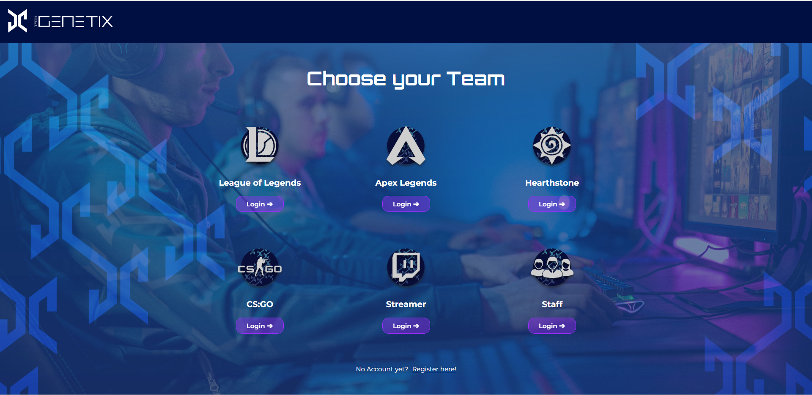
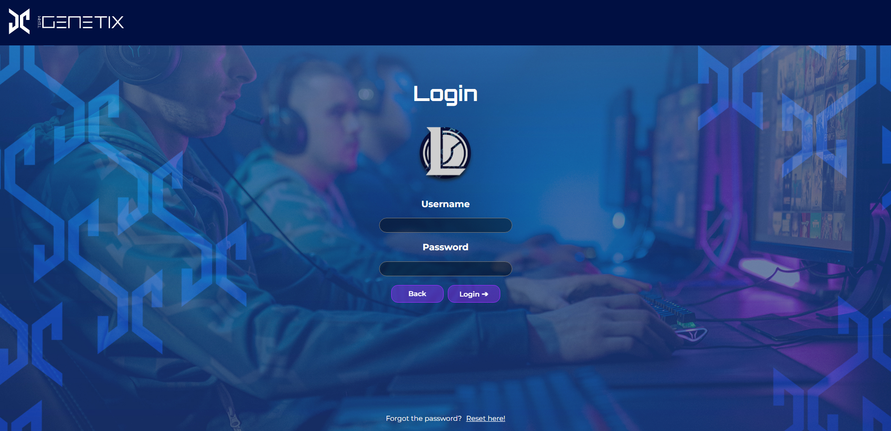
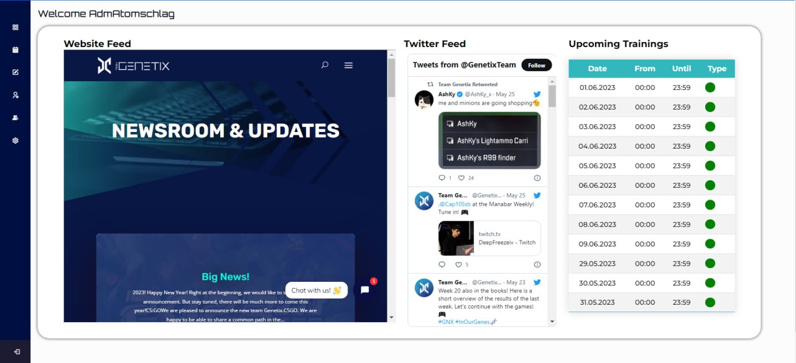
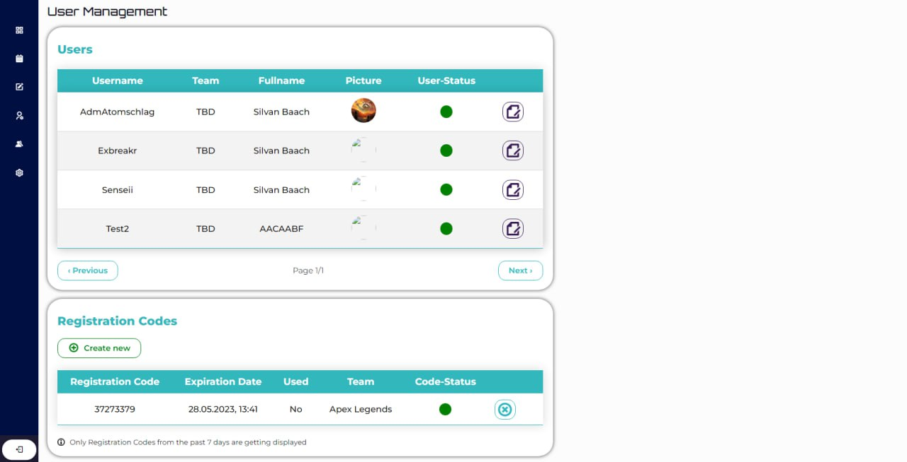
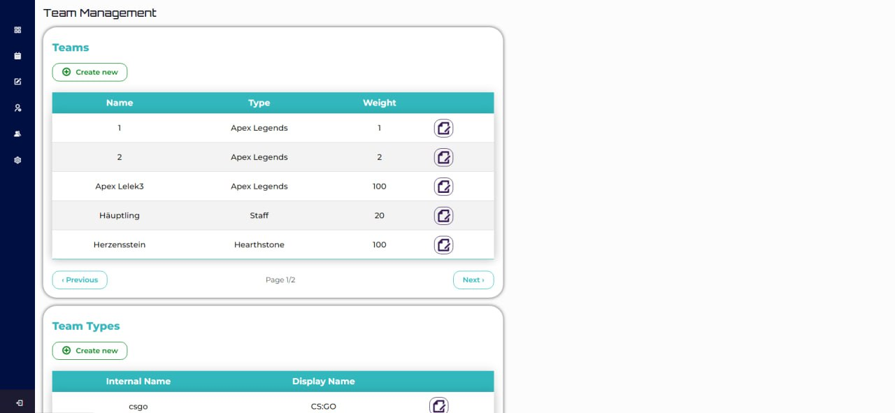
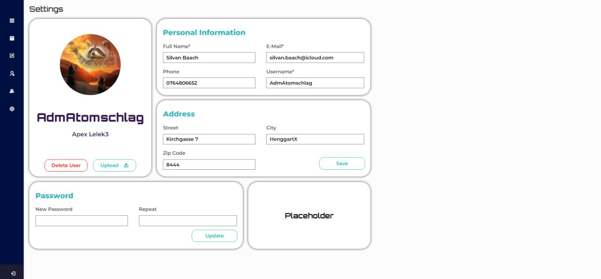

<div align="center">


[](Issues)
&nbsp;&nbsp;&nbsp;&nbsp;
[](ClosedPullRequests)
&nbsp;&nbsp;&nbsp;&nbsp;
[](License)
&nbsp;&nbsp;&nbsp;&nbsp;
[](Contributors)


</div>

<h1>Table of Contents</h1>

<!--ts-->

- [GNX_Webapp](#gnx_webapp)
    - [Details 🔍](#details-)
    - [Screenshots 📸](#screenshots-)
- [Documentation 📚](#documentation--tbd)
    - [Techstack und Tools 🧰](#techstack-und-tools-)
    - [API Reference 🖇️ TBD](#api-reference-️-tbd)
    - [Possible Future Extension 💡](#possible-future-extension-)
- [Security 👮](#security-)
- [Branching Model and Naming 🌿](#branching-modell-and-naming-)
- [Commit Messages 📝](#commit-messages-)
- [Versioning 📌](#versioning-)
- [Acknowledgements 🙏](#acknowledgements-)
- [Authors 🪶](#authors-)
- [Contributing 🤝](#contributing--tbd)
- [Support ⭐](#support-)
- [License 📜](#license-)

<br >

# GNX_Webapp

The aim of this project is to write a web application for Team Genetix.\
This should facilitate the internal communication and coordination of the individual teams, as well as make the work processes of the staff members smoother.\
The portal should also be a foundation for further ideas and projects in the future.
Here you can reach the [Webapp](https://webapp.teamgenetix.ch/).

## Details 🔍

**Infrastructure**

In the first phase, the project will be hosted by a member of Team Genetix.\
A Mac Mini (2012) with 1 TB of storage space is available for this purpose.\
It has more than enough power to provide some web services and file services on the internet.\
A Synology NAS is used as a backup device.\
If off-site backups are desired at a later date, a different backup strategy must be worked out.

**Planned Features**

**Administration**

The following are the main use cases for the administration of the Genetix webapp:

***Manage registration codes***

It should be possible to create new registration codes, reactivate expired codes and deactivate valid codes.\ 
When creating a new code, it should also be possible to select which role is assigned to the new user after registration.\
Using this generated code, a new user can register in the web app within the next 24 hours.

***User management***

It should be possible to edit all user data, reset the password and lock and unlock users.\
Users should be displayed in a tabular view.

***Team management***

It should be possible to create new teams and edit or delete existing teams.\
A team should have at least one unique name and be assignable to a team type.

***Team type management***

It should be possible to create new team types and edit existing ones.\
However, it should not be possible to delete team types in the webapp itself.

**Members**

The main use cases for members are listed below:

***Permissions***

Each member can belong to any number of teams.\
The team types to which these teams are assigned define the permissions of the individual user.\
The permissions define which pages are accessible.

***Registration***

A new user account must first be created by a user who has administrative rights.\
When registering, the user should be able to enter various data, including place of residence, name and age.\
Registration should only be possible using a unique registration code that is valid for 24 hours.

***Login***

Each club member should be able to log in via a login page.\
The member should be able to enter their password incorrectly a maximum of 5 times before the user is locked out.\
There should also be the possibility to reset the password via the stored email address.

***Dashboard***

The dashboard should be the start page for every club member.\
It should display current information, links to social media channels and the next upcoming dates or events.

***Calendar***

The aim of the calendar is to allow teams to find internal training dates.\
It should be possible to configure time ranges, absences, ambiguities or availabilities for each day.\
It should also be possible to enter appointments as far into the future as required.\
A table should also be able to generate a list of the next upcoming trainings based on the calendar data entered.\
It should be possible to configure from how many participants the training will take place.

<br >

## Screenshots 📸

| Page                                                                          | Description                                                                           |
|:------------------------------------------------------------------------------|:--------------------------------------------------------------------------------------|
|  <br/> Landing Page                 | The Landing Page is the first Page that the user sees, once he opens the website.     |
|  <br/> Login Page                     | The Login Page is where the user can log in with his credentials.                     |
|  <br/> Home Page                       | The Home Page is the first Page after the log in.                                     |
|  <br/> Calendar Page               | The Calendar Page is the Page where the user can see and edit his training sessions.  |
|  <br/> User-Management Page | The User Management Page is only for admins to invite and manage existing users.      |
|  <br/> Team-Management Page | The Team Management Page is to create new teams.                                      |
|  <br/> Settings Page               | The Settings Page is where the user can modify his data's.                            |

<br >

# Documentation 📚

You can find the documentation for the project in the [Software-Guidebook](https://genzhaw.github.io/GNX_Webapp/).

## Techstack and Tools 🧰

* [Kotlin](https://kotlinlang.org/)
* [SQLiteDatabase](https://developer.android.com/training/data-storage/sqlite)
* [Material Design](https://material.io/)
* [Figma](https://www.figma.com/)
* [IntelliJ](https://www.jetbrains.com/idea/)
* [Android Development](https://developer.android.com/)
* [GIT LFS](https://git-lfs.github.com/)

<br >

## API Reference 🖇️ TBD

| Parameter | Type     | Description                       | Call                        |
|:----------|:---------|:----------------------------------|:----------------------------|
| `api_key` | `string` | **Required**. Your API key        | `http GET /api/items/${id}` |
| `id`      | `string` | **Required**. Id of item to fetch | `http GET /api/items/${id}` |

## Possible Future Extension 💡

**Statistics pages**

Statistics pages are to be created for various teams.\
The information of the respective game via API is to be loaded into the web app, where it is then displayed.\
The game accounts are to be linked to the user.

**Onlineshop**

There is to be an online shop where members and, if necessary, guests can buy individual branded fan articles.\
In the first phase, payments and orders from suppliers should be made manually by the club administration.\
If desired, these parts could be automated in the future.

**Fileshare -Version 2.0**

The Fileshare is to be expanded to include a full authorisation system.\
This will enable individual members to upload data and release it via a link.\
The individual teams are also to receive a private folder in which they can share files.

# Security 👮

If you discover any security related issues, please use the issue tracker instead of sending a mail.

# Branching Model and Naming 🌿

We use a simplyfied version of
the [Gitflow](https://www.atlassian.com/de/git/tutorials/comparing-workflows/gitflow-workflow) workflow.

| Name        | Description                                                                                                                                                                                                                                                                                                        |
|:------------|:-------------------------------------------------------------------------------------------------------------------------------------------------------------------------------------------------------------------------------------------------------------------------------------------------------------------|
| `main`      | The master branch contains the production code and stores the official release history.                                                                                                                                                                                                                            |
| `develop`   | The develop branch contains pre-production code and serves as an integration branch for features                                                                                                                                                                                                                   |
| _`feature`_ | Each new feature should reside in its branch, which can be pushed to the central repository for backup/collaboration. Feature branches use the latest develop as their parent branch. When a feature is complete, it gets merged back into develop. Features should never interact directly with the master branch |

<div align="center">


</div>

As for the naming of the feature branches, we use the following convention:
`<issue-id>-<issue-name>[-<short-description>]`

# Commit Messages 📝

The following section is a must. It is a good practice to write a commit message in the
following format:

```
Format:
<type>(<scope>): <subject> [<issue number>]

Example:
feat(Save Button): Implemented save button [MF-1]
```

The following types should be used:

* ci: Changes to our CI configuration files and scripts
* docs: Documentation only changes
* feat: A new feature
* fix: A bug fix
* refactor: A code change that neither fixes a bug nor adds a feature
* style: Changes that do not affect the meaning of the code (white-space, formatting, missing semi-colons, etc)
* test: Adding missing tests or correcting existing tests

_For more information, please refer to
the [Angular Commit Message Guidelines](https://www.conventionalcommits.org/en/v1.0.0/)_

# Versioning 📌

We make it easy for you to keep track of the versions of our project. For transparency into our release cycle and in
striving to maintain backward compatibility, we will be adhering to [Semantic Versioning](http://semver.org/) guidelines
whenever possible.

# Acknowledgements 🙏

A big thank you to all the people who have contributed to this project. We are very grateful for your support and help,
especially to the open source community.

- [Awesome Readme Templates](https://awesomeopensource.com/project/elangosundar/awesome-README-templates)
- [Awesome README](https://github.com/matiassingers/awesome-readme)
- [How to write a Good readme](https://bulldogjob.com/news/449-how-to-write-a-good-readme-for-your-github-project)
- [Shields.io](https://shields.io/)
- [Ich danke Gott, meiner Familie und Freunden. Und den Rest verdank ich 5, 6 Leuten.](https://genius.com/4160880)

# Authors 🪶
Build with ❤️ by
- [@Alperen1999](https://www.github.com/Alperen1999) (sevicalp)
- [@armandoshala](https://www.github.com/armandoshala) (shalaar3)
- [@BadrOutiti](https://www.github.com/BadrOutiti) (outitbad)
- [@Dylanas](https://www.github.com/Dylanas) (illikev1)
- [@Jaypi95](https://www.github.com/Jaypi95) (peterju1)
- [@jondef](https://www.github.com/jondef) (defiljon)
- [@omerasipi](https://www.github.com/omerasipi) (asipiome)
- [@silvanbaach](https://www.github.com/silvanbaach) (baachsil)

# Contributing 🤝

This project was created for the course "PM4" at the University of Applied Sciences in Zurich.
Since the course is over, we will not be able to maintain this project. However, we will be happy to accept any
contributions that you may have.
Feel free to fork or clone this repository as long as you obey the License (Please refer to the license section for more information.)

# Support ⭐

If you like our project, please consider supporting us by giving a ⭐ on our project!

# License 📜

GNX_Webapp is distributed under the terms of the [Apache License (Version 2.0)](https://www.apache.org/licenses/LICENSE-2.0).
